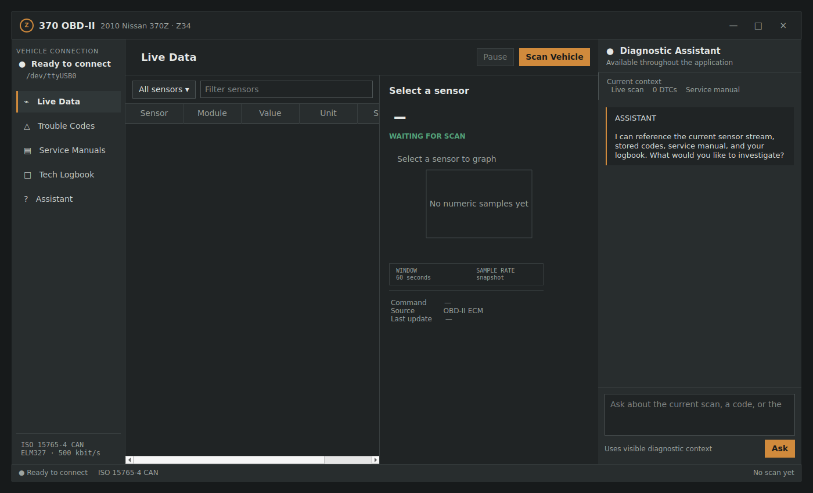
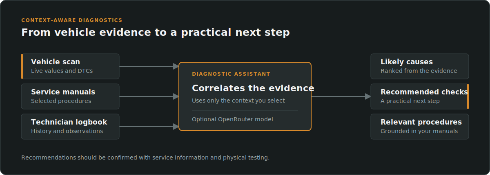
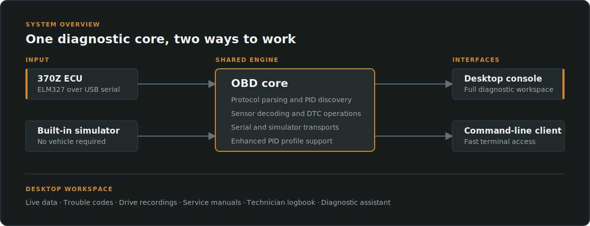

# 370 OBD-II

A focused OBD-II diagnostic application for the 2009–2010 Nissan 370Z (Z34), built in C++17 with a Qt 6 desktop interface and a lightweight command-line client.

[](https://isocpp.org/)
[](https://www.qt.io/)
[](https://cmake.org/)
[](#requirements)



## Overview

370 OBD-II combines live vehicle data, trouble-code management, AI-assisted troubleshooting, service-manual reference, and technician notes in one desktop workspace. It works with a real ELM327 USB adapter or the included simulator, allowing the application to be explored and tested without connecting to a vehicle.

| Capability | Details |
| --- | --- |
| Live data | Discovers supported Mode 01 PIDs and decodes RPM, temperatures, load, fuel trims, airflow, throttle position, and more |
| Trouble codes | Reads stored, pending, and permanent DTCs through Modes 03, 07, and 0A; clears stored and pending codes through Mode 04 |
| Enhanced PIDs | Loads manufacturer-specific definitions from CSV without requiring a rebuild |
| Recording | Records drive data to CSV and replays it through the sensor table and chart at the original pace |
| Service information | Opens and searches locally owned factory service-manual PDFs |
| Diagnostic assistant | Helps investigate symptoms and DTCs using the current scan, service manuals, and previous technician notes |
| Technician logbook | Keeps scan snapshots, observations, and diagnostic analysis together locally |

## AI-assisted troubleshooting

The built-in diagnostic assistant helps turn scan results into a practical troubleshooting path. Instead of asking a general-purpose chatbot without vehicle context, you can choose which diagnostic information accompanies your question:

- Current live sensor values and DTCs
- Relevant excerpts from locally owned service manuals
- Previous observations and scan history from the technician logbook

Ask about a fault code, an unusual sensor reading, or a symptom such as a rough idle. The assistant can correlate the available evidence, suggest likely causes, identify useful manual procedures, and propose the next checks to perform. Responses can be saved to the logbook so the investigation remains available for later sessions.



The assistant is optional and uses OpenRouter. You control when it is used and which available context is included. Its recommendations are a troubleshooting aid and should be verified against service information and physical testing before repairs are made.

## How it fits together



The shared `obdcore` library owns protocol parsing, PID discovery, decoding, scan sessions, and transport behavior. Both interfaces use the same diagnostic implementation.

## Requirements

- Linux
- CMake 3.20 or newer
- A compiler with C++17 support
- Qt 6 Widgets, Network, SerialPort, PDF, and PDF Widgets for the desktop app
- Qt6Keychain for secure API-key storage
- Poppler utilities for service-manual text search
- An ELM327-compatible USB adapter for vehicle access

On Ubuntu or Debian:

```bash
sudo apt install cmake qt6-base-dev qt6-serialport-dev qt6keychain-dev poppler-utils
```

## Build

```bash
git clone https://github.com/AQuietRiver/370obd2.git
cd 370obd2
cmake -S . -B build
cmake --build build
ctest --test-dir build --output-on-failure
```

If the Qt dependencies are unavailable, CMake skips the desktop target and still builds the CLI and tests. A headless build can also be requested explicitly:

```bash
cmake -S . -B build -DBUILD_GUI=OFF
cmake --build build
```

See [docs/SETUP.md](docs/SETUP.md) for sanitizer options, service-manual setup, and assistant privacy details.

## Run

Start the desktop application:

```bash
./build/370obd2_gui
```

Run the CLI against the simulator:

```bash
./build/370obd2_cli
```

Connect to a vehicle through an ELM327 serial device:

```bash
./build/370obd2_cli --serial /dev/ttyUSB0
```

Clearing stored and pending DTCs is always explicit:

```bash
./build/370obd2_cli --clear-dtcs --serial /dev/ttyUSB0
```

The default enhanced-PID profile is `data/sample_nissan_z34_enhanced_pids.csv`. Pass another CSV file as the final CLI argument to use a different profile.

## Project structure

```text
src/core/       Protocol, parsing, PID registry, scan sessions, and transports
src/gui/        Qt 6 desktop application
src/main.cpp    Command-line entry point
data/           Enhanced-PID CSV profiles
tests/          Unit tests for the shared core
docs/           Setup documentation and project images
logbook/        Local technician logbook
```

## Safety and privacy

- Clearing DTCs resets the malfunction indicator lamp and emissions-readiness status. The desktop app requires confirmation before clearing codes on a real vehicle.
- The included enhanced-PID CSV demonstrates the import format; its values are not verified Nissan factory data.
- Factory service manuals are copyrighted and are not distributed with this repository. Place legally obtained PDFs in the untracked `manuals/` directory.
- The diagnostic assistant is optional. API keys can be held for the current session or stored in the operating-system keyring; they are never written to project files or plaintext settings.
- Selected diagnostic context is sent to OpenRouter only when the assistant is used. OpenRouter pricing and data policies apply.
